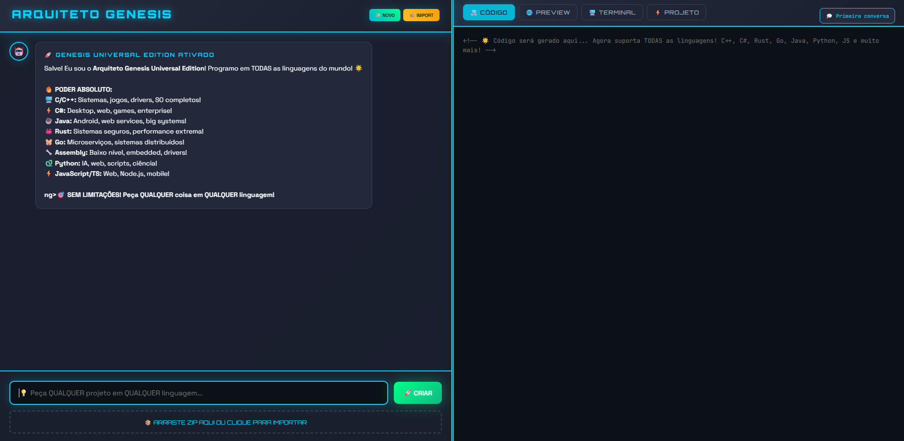
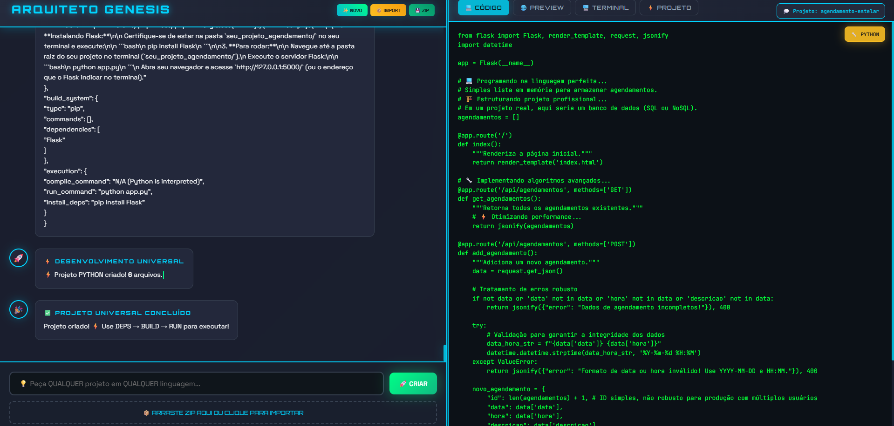

# 🏗️ Arquiteto Genesis – Universal Edition

O Arquiteto Genesis é uma plataforma open source que utiliza um Agente de Codificação em 4 Camadas para criar, modificar, compilar e executar projetos completos em praticamente qualquer linguagem.

Seja para **estudo**, **prototipagem** ou até mesmo desenvolvimento de aplicações reais, o Genesis oferece um ambiente interativo com **pré-visualização ao vivo, terminal integrado** e suporte a **importação/exportação** de projetos.

---

## ✨ Funcionalidades

### 🔹 Criação e Modificação de Código com IA
- Suporte a **C, C++, C#, Java, Python, JavaScript, TypeScript, Rust, Go, PHP, Ruby, Swift, Kotlin, Assembly e mais**;
- Geração de código **estruturado com padrão MVC**;
- Modificações inteligentes preservando funcionalidades existentes.

### 🔹 Ambiente Completo de Desenvolvimento
- **Editor de Código** integrado com destaque de sintaxe;
- **Preview com Backend Ativo** para aplicações Web;
- **Terminal Multi-linguagem** para compilar e executar com comandos reais;
- **Importação de Projetos ZIP** existentes para edição.

### 🔹 Execução Real
- Build e run **nativo** para cada linguagem;
- Servidor local com porta dinâmica para apps web;
- Exportação do projeto como arquivo ZIP pronto para rodar.

### 🔹 Inteligência Contextual
- A IA **lembra do histórico** e consegue evoluir projetos existentes;
- Geração de **blueprints e arquitetura técnica** automaticamente.

---

## 🖥️ Linguagens Suportadas
- ✅ C / C++
- ✅ C#
- ✅ Java
- ✅ Python
- ✅ JavaScript / TypeScript
- ✅ Rust
- ✅ Go
- ✅ PHP
- ✅ Ruby
- ✅ Swift
- ✅ Kotlin
- ✅ Assembly
- ...e muitas outras!

---

## 📸 Capturas de Tela 

  

---

## 🚀 Instalação e Uso

### 1️⃣ Pré-requisitos
- Python 3.9+
- Conta no [Google AI Studio](https://ai.google.dev/) com **API Key do Gemini**
- Pacotes de build para linguagens desejadas (gcc, g++, node, java, etc.)

### 2️⃣ Clonar o Repositório
